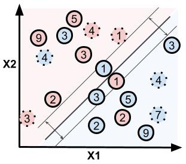

# Precision Medicine: Individualised Treatment Regimes

## Abstract 

Precision Medicine aims to deliver patient-centered care beyond
one-size-fits-all treatment rules, by accounting for heterogeneity in treatment
effect to determine patient subgroups. In- dividualization promises two
benefits: (i) to extend the population mean survival (ii) to spare patients
from aggressive treatment who are unlikely to benefit. The "Direct Value
Search" approach frames the estimation of Individualized Treatment Rules as an
Empirical Risk Mini- mization problem, allowing for the use of classification
techniques which avoid strict assump- tions of parametric regression models,
and therefore minimize the possibility of misspecifica- tion. 

This thesis reviews a series of developments in Outcome Weighted Learning (OWL)
meth- ods that handle right-censored survival outcomes. We evaluate the
proposed efficiency-gain and distributional robustness of the Multistate
Outcome Weighted Learning (MSOWL) method. MSOWL integrates
Inverse-Probability-Censoring-Weighted individual stochastic benefit pro-
cesses, including right-censored cases, at the cost of cubic computational
complexity, which can be ameliorated via divide and conquer. We analyze a novel
data set from an oncologi- cal clinical trial, which assesses the inclusion of
immunotherapy to standard chemotherapy for Pancreatic Cancer. 

## Keywords:
Precision Medicine, Survival Analysis, Causal Inference, Clinical Trials,
Missing Data, Statistical Learning, Support Vector Machine

## Data 
The clinical trial data are available via
[projectdatasphere.org](https://data.projectdatasphere.org/projectdatasphere/html/home).

## Acknowledgement 
This thesis investigates the method of Bakoyannis Multistate
Outcome Weighted Learning, [Biostatistics
2023](https://onlinelibrary.wiley.com/doi/full/10.1111/biom.13864), code
available on [Github](https://github.com/gbakoyannis/msowl/)

